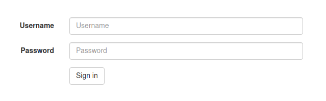
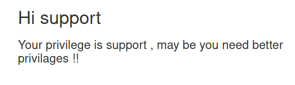
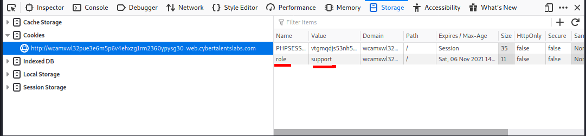
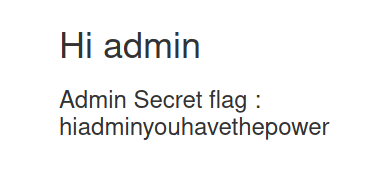

# Admin has the power
```
Administrators only has the power to see the flag , can you be one ?
```

## Solve:

- After visiting the website, we will see a login page.


    


- When viewing the page source, we can notice that the developer left a crispy comment:
    ```html
    <!-- TODO: remove this line ,  for maintenance purpose use this info (user:support password:x34245323)-->
    ```


- Now lets login with these credentials, now we see that we have to be an admin to see the flag.


    


- Let's take a look at the cookies:


    


- Nice ! plain text, Now if we changed the role to admin instead of support the flag will pop up.


    


> **Flag: hiadminyouhavethepower**
