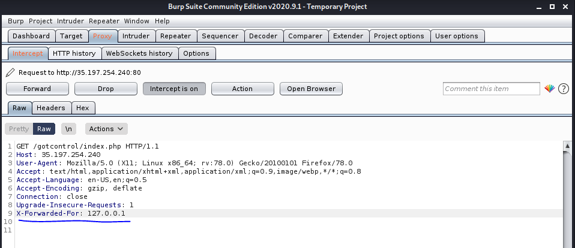

## Got Controls
```
We believe we made a good job protecting our infrastructure, can you bypass our controls.
```
- Link: http://35.197.254.240/gotcontrol/

#### Solve:

- Steps

    - When you visit the website you will see a message telling you:
        ```
        Sorry, your IP is not allowed, this server is only accessible from local machine or local LAN.
        ```

    - Now, we need to think of a way that the server could be checking our ip with, first thing comes in mind is the *[X-Forwarded-For](https://developer.mozilla.org/en-US/docs/Web/HTTP/Headers/X-Forwarded-For)* header.

    - Now, we modify the request from *burp* and add the *X-Forwarded-For* header with the local ip address: *127.0.0.1* and then forward the request.
        
        
    
    - Pingo ! here we go, the flag appeared on the web page !

> **Flag: FLAG{NEVER_TRUST_HEADERS}**