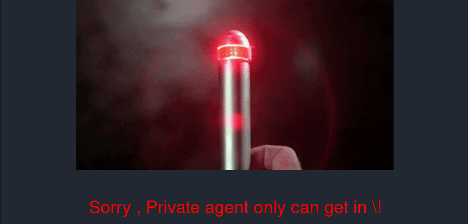
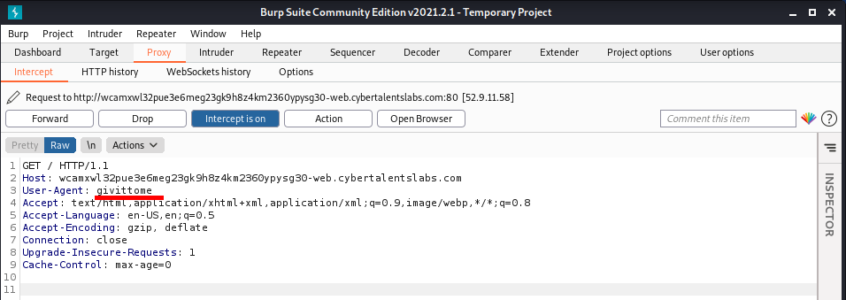
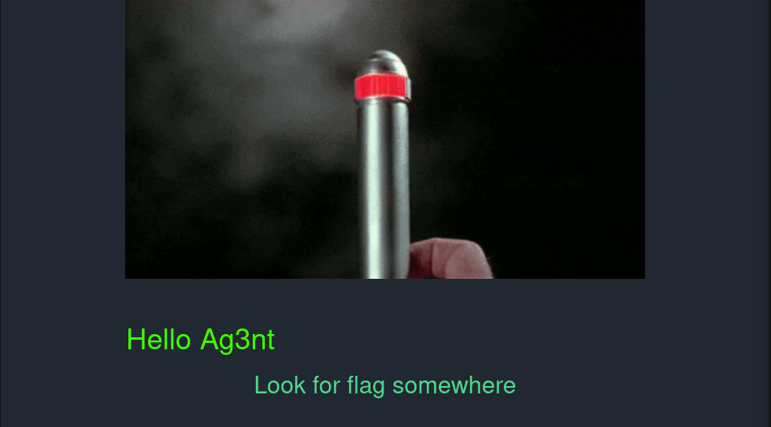
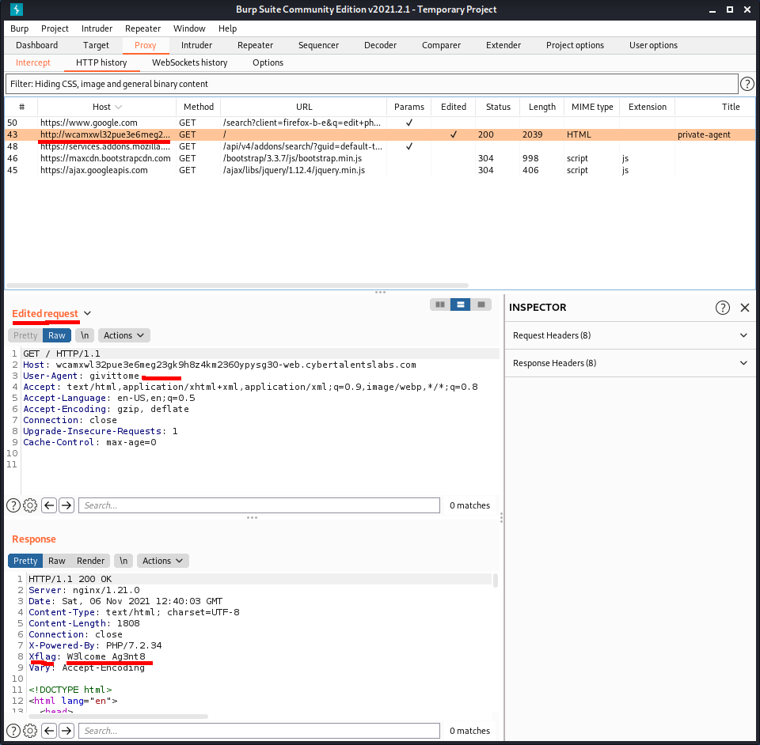

## Private Agent
```
Only private agents can make their way to the gate.
```

## Solve:

- After visiting the website, we will see a flashing GIF and a message that says only private agent can see the flag.
    

- From the challenge's name *Private Agent* and category *Web Security*, we can conclude that there is something about our browser agent.

- When viewing the page source, we can notice that there is an important comment:
    ```html
    <!-- TO_Be_Removed => Privet-Agent access => givittome-->
    ```

- Alright, we found an agent *givittome*, let's try to make a request to the website with this agent.
    

- Now, we see another output meaning that we are on the right way ! And, the page says to look for the flag somewhere.
    

- If we look under our Burp's http requests tab, we will see the request made and the response to it from the server.
    

- Yup, we see that the server response contains a custom header *Xflag* and its value indeed is the flag !

> **Flag: W3lcome_Ag3nt8**