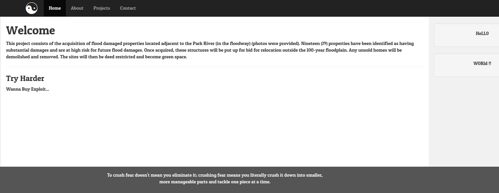
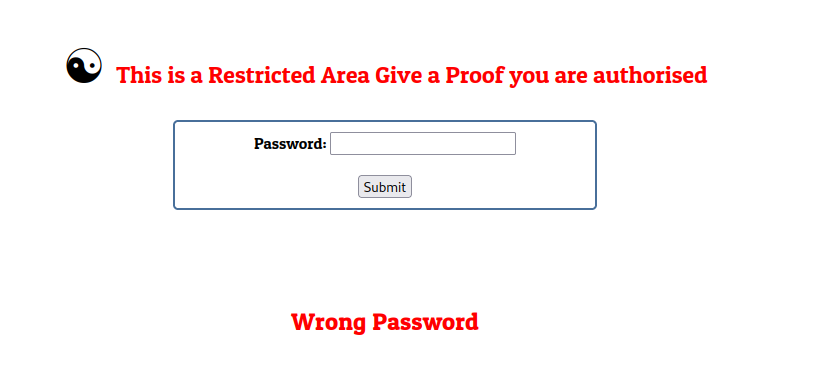
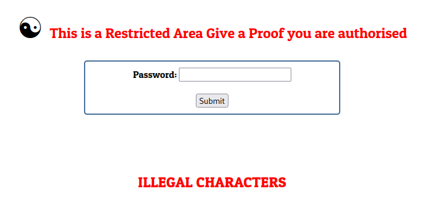

# catch me if you can
```
I'm Just wanna Make Sure if you Are Mr.Robot
```

## Solve:

- After visiting the website, we can see a static page with no links no interaction.
    


- Let's see what is inside the *robots.txt* file:
    ```
    User-agent: *
    Disallow: /S3cr3t.php
    Disallow: /source.php
    ```


- Looking at */S3cr3t.php* we can see a login page:
    


- If we take a look at the other file */source.php*, we can see the source code of */S3cr3t.php*:
    ```
    <?php
    include('flag.php');
    $password=$_POST['pass'];
    
    if (strpos( $password, 'R_4r3@')!== FALSE){
        if (!preg_match('/^-?[a-z0-9]+$/m', $password)) {
            die('ILLEGAL CHARACTERS');
            }
    echo $cipher;
        }
    else 
    {
        echo 'Wrong Password';
        }
    ?>
    ```
  

- Let's understand the important lines of the code


- As we can see it's taking the *$password* var from the get vars and then trying to check if the password contains a specific word *R_4r3@* by using the *strpos* built-in php function
    ```
    if (strpos( $password, 'R_4r3@')!== FALSE){
    ```


- Now, as we understood this line we can try and enter *R_4r3@* as a password.
    


- Nice we see different output which is an indicator that we passed the first condition, moving to the next one.


- If you are having hard time reading/parsing the regex you can check [regex101](https://regex101.com/), 
it helped me understand this regex and after some tries I reached to a good point where I understood
that if we put another string in another line it will match with one and leave the other.


- What I did is encoding this string
    ```
    elitebaz
    R_4r3@
    ```
  to be like this
    ```
    %65%6c%69%74%65%62%61%7a%0a%52%5f%34%72%33%40
    ```
  then sent it with burp.


- Nice ! we got back a *brainfuck* encoded response:
    ```
    -[------->+<]>---.++++++.------------.--[--->+<]>---.[----->+<]>.[--->++<]>.>-[----->+<]>.>-[--->+<]>--.[--->+<]>+++.--.--[->+++++<]>+.---[-->+++<]>--.+[----->+<]>.++[++>---<]>.+[->++<]>.-----.+[--->++<]>+.--[----->+<]>-.>-[----->+<]>.+.>--[-->+++<]>. 
    ```


- Using [dcode.fr](https://www.dcode.fr/brainfuck-language) to decode it, and we get the flag !


> **Flag: FL@g{R3Str1Ct1d_Ar34}**